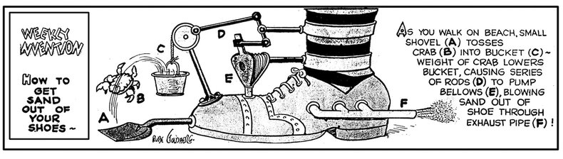

## Introduction

[Rube Goldberg](https://en.wikipedia.org/wiki/Rube_Goldberg), the famed cartoonist and inventor, is best known for his hilariously complex contraptions designed to perform simple tasks—like using a series of levers and pulleys. 
While his inventions were meant to entertain, data engineers sometimes unknowingly bring his spirit to life in their pipelines.

*How to Keep from Dozing Off During Business Hours, [src](https://www.rubegoldberg.org/all-about-rube/cartoon-gallery/category_2/id_41)*

This brings us to the concept of overly complex or inefficient data pipelines—systems that perform simple tasks in unnecessarily convoluted ways, much like the whimsical creations of Rube Goldberg. Sound familiar? Congratulations — you might have a Rube Goldberg Data Pipeline.

In this post, I will explore the world of over-engineered, or just downright clumsy data pipelines. We’ll identify the telltale signs of unnecessary complexity and share strategies to avoid building one yourself. Over the last year I encountered many instances of comic (anti) design patterns, workarounds, and Vendor limitations. I gathered a few without the need for completeness. These examples are unique, but because while Rube Goldberg machines are fun to watch, they’re a nightmare to maintain in production.

*How to Keep the Boss from Knowing When You Are Late to Work, [src](https://www.rubegoldberg.org/all-about-rube/cartoon-gallery/category_2/id_52)*
## Over Engineering without the eyes on the Added Business Value

We need to focus on what's actually matters, which is driving business by building trustworthy data analytics, which enables better decision making, and ultimately creates better products and services, happier customers, and leads to more successful businesses.
I think over-engineering is a fairly common pattern in both Software and Data Engineering as well, and I'm not gonna lie, I have been guilty of this. To avoid this trap, it’s essential to differentiate between ad-hoc analytics and robust systems—and to gain a clearer understanding of business requirements.

I saw companies at both ends of the spectrum, and technically you could argue that someone could build technical debt while building a data pipeline with the complexity of a space rocket. My get-go example of over-engineering is building real-time pipelines for imaginary business needs.  I’ve seen teams get excited about the idea of real-time data processing, only to realise later that their business operates perfectly fine with batch processing every few hours. The obsession with real-time systems often stems from a “cool factor” rather than a genuine business requirement.

On the flip side, under-engineering is just as dangerous. I've encountered pipelines where critical business decisions relied on jobs held together by fragile scripts, prone to failures with no monitoring in place. In these cases, technical debt accumulates rapidly, making even small changes risky and unpredictable. The key is finding the right balance: optimising for maintainability, cost, and actual business needs rather than overcomplicating things for the sake of “engineering purity.”

## Building  on top of cumbersome interfaces: Jumping hoops to access your company’s data
### Rest APIS
Often, we’re stuck using interfaces that were never designed to handle high volumes of data. For example, I’ve encountered multiple cases where APIs, built to serve as interfaces between an app’s backend and its mobile users, were repurposed for large-scale data extraction. 
APIs optimised for fetching small amounts of data for individual users, end up being used to retrieve customer attributes for millions of records—leading to bottlenecks and inefficiencies.

While these APIs work well for a single customer, they often fail under the load of millions of requests, plagued by rate limits, leaky bucket algorithms, and dreaded HTTP 429 errors (“Too many requests”). As a data engineer, your options are limited: you can pressure external SaaS vendors to provide better interfaces or resort to hacky workarounds, like rotating multiple API keys for better parallelisation. In larger organisations, this issue isn’t confined to external vendors—it often arises between internal teams as well. This is where a seasoned CDO (or an equivalent leader) needs to communicate the importance of scalable interfaces.

In general, I believe REST APIs—and even GraphQL to an extent—aren’t ideal interfaces for sharing large volumes of information between services and data platforms. A better alternative would be for vendors to offer flat-file-based interfaces using [S3-compatible storage](https://m.xkcd.com/927/) and [open table formats](https://www.starburst.io/data-glossary/open-table-formats/). This would be especially beneficial for widely used services like Shopify, Klaviyo, and Recharge, which cater to SMEs.

*Painless Tooth Extractor, [src](https://www.rubegoldberg.org/all-about-rube/cartoon-gallery/category_2/id_90)*

### Google Analytics

Speaking of jumping through hoops, why do I need to set up a GCP project, a billing account, and BigQuery just to access the raw data collected by GA4? As of writing this post, that’s the reality. If anything truly deserves the title of “Rube Goldberg’s Data Pipeline,” this convoluted process is a prime candidate.

Don’t get me wrong—I’m not a GCP nor a BigQuery hater. But for companies who want to maintain a clean, non-GCP architecture (whether it's on AWS, Azure, or anything else), GA4 introduces unnecessary clutter. It’s a well-functioning tool, but also frustratingly limiting and a prime example of vendor lock-in.

### Ingestion tools in general: I heard you love complexity

If your goal is to introduce complexity, I highly recommend using [Meltano](https://meltano.com/), but instead of a [Singer](https://hub.meltano.com/singer/spec/) wrapper [use it to access Airbyte](https://meltano.com/blog/meltano-community-contribution-enables-running-over-200-airbyte-connectors/). Because managing ingestion tools via another tool must be an elegant design decision, right? Better yet, if you want to confuse your team, you could start using [dlt](https://dlthub.com/) (data load tool) a lightweight ingestion framework in your Databricks project, where the keyword *dlt*  is reserved by Databricks own [dlt](https://www.databricks.com/product/delta-live-tables) (Delta Live Tables) 
I promise—it’s an experience worth writing about (though not for the reasons you might hope). If you’re curious, check out this [detailed guide on using dltHub in a DBX workspace](https://dlthub.notion.site/Databricks-notebook-instructions-980832a90fab4a98b6c8aa010d47646e).
## Decoupled Scheduling

I’ve seen many platforms struggle with this issue. Often, different components of data pipelines are orchestrated independently, completely decoupled from one another. As a result, the platforms rely on heuristics to guess whether the ingestion pipelines have completed running or not.

This (anti) pattern can be resolved by introducing a dedicated orchestration tool like [Airflow](https://airflow.apache.org/) or [Dagster](https://dagster.io/). These tools manage inter-service dependencies and trigger executions in a structured and reliable manner. While they do add an additional layer of complexity, in my opinion it’s a highly worthwhile investment.
## Transformation

Did you create a custom transformation framework from scratch instead of leveraging tools like dbt, SQLMesh or native SQL transformations? Congratulations, you’ve built another layer of unnecessary complexity. I’ve seen teams go down this path, convinced that their use case is too “unique” for off-the-shelf transformation tools. They build elaborate frameworks with custom DAG orchestration, bespoke dependency management, and layers of abstraction that nobody but the original developers understand. Fast forward a year, and those developers have moved on, leaving behind a black-box system that nobody wants to touch.

	
*How to Get Sand Out of Your Shoes, [src](https://www.rubegoldberg.org/all-about-rube/cartoon-gallery/category_2/id_108)*
## Final Thoughts

The essence of Rube Goldberg-inspired Data Pipelines lies in their unnecessary complexity. While some challenges are unavoidable (like poor vendor APIs or platform limitations), many arise from a lack of focus on business value, over-engineering, or simply not considering more straightforward alternatives.

At the end of the day, simplicity, scalability, and clear alignment with business needs should guide data engineering efforts. Remember, just because you _can_ build something complex doesn’t mean you _should_.